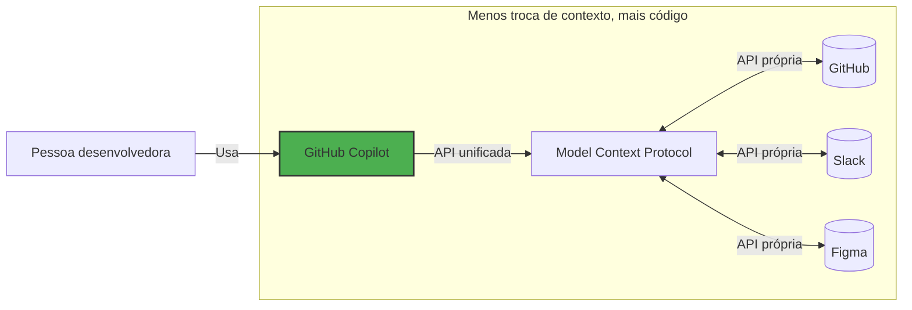

## Step 1: Introdução ao MCP e preparação do ambiente


No exercício [Getting Started with GitHub Copilot](https://github.com/dev-pods/getting-started-with-github-copilot), conhecemos o site de atividades extracurriculares da Mergington High School, que permitia que estudantes se inscrevessem em eventos.

E agora temos um problema... mas... é um problema bom! Mais professores estão pedindo para usá-lo! 🎉

Nossos colegas professores têm muitas ideias, mas não conseguimos acompanhar todos os pedidos! 😮 Para resolver isso, vamos dar um upgrade no GitHub Copilot habilitando o Model Context Protocol (MCP). Mais especificamente, vamos adicionar o GitHub MCP server, que vai permitir um fluxo combinado de gerenciamento de issues e melhorias no site. 🧑‍🚀

Vamos começar!

### 📖 Teoria: o que é o Model Context Protocol (MCP)?

O [Model Context Protocol (MCP)](https://modelcontextprotocol.io/introduction) é frequentemente descrito como o "USB-C da IA" — um conector universal que permite ao GitHub Copilot (e a outras ferramentas de IA) interagir de forma fluida com outros serviços.

Basicamente, é uma maneira de descrever as capacidades e os requisitos de um serviço, para que ferramentas de IA consigam determinar facilmente quais métodos usar e informar os parâmetros corretos. Um MCP server é quem fornece essa interface.



### :keyboard: Atividade: conheça o seu ambiente

Antes de mergulhar no MCP, vamos iniciar nosso ambiente de desenvolvimento e relembrar a aplicação de atividades extracurriculares.

1. Clique com o botão direito no botão abaixo para abrir a página **Create Codespace** em uma nova aba. Use a configuração padrão.

   [](https://codespaces.new/{{full_repo_name}}?quickstart=1)

1. Confirme que as extensões **Copilot Chat** e **Python** estão instaladas e habilitadas.

   <br/>
   

1. Verifique se a aplicação executa antes de qualquer modificação. Na barra lateral esquerda, selecione a aba **Run and Debug** e depois clique no ícone **Start Debugging**.

   <details>
   <summary>📸 Mostrar captura de tela</summary><br/>

   

   </details>

   <details>
   <summary>🤷 Com dificuldades?</summary><br/>

   Se a área **Run and Debug** estiver vazia, tente recarregar o VS Code: abra a paleta de comandos (`Ctrl`+`Shift`+`P`) e procure por `Developer: Reload Window`.

   

   </details>

1. Use a aba **Ports** para encontrar o endereço da página, abra-o e confirme que a aplicação está no ar.

   <details>
   <summary>📸 Mostrar captura de tela</summary><br/>

   

   

   </details>

### :keyboard: Atividade: adicionar o GitHub MCP server

1. Dentro do seu codespace, abra o painel **Copilot Chat** e confirme que o modo **Agent** está selecionado.

   

   <details>
   <summary>O modo Agent não aparece?</summary><br/>

   - Verifique se o VS Code está pelo menos na versão `v1.99.0`.
   - Verifique se a extensão do Copilot está pelo menos na versão `v1.296.0`.
   - Confira se o modo Agent está habilitado nas suas [configurações de usuário ou de workspace](https://code.visualstudio.com/docs/configure/settings#_workspace-settings).

      

   </details>

1. Dentro do seu codespace, navegue até a pasta `.vscode` e crie um novo arquivo chamado `mcp.json`. Cole o seguinte conteúdo:

   📄 **.vscode/mcp.json**

   ```json
   {
     "servers": {
       "github": {
         "type": "http",
         "url": "https://api.githubcopilot.com/mcp/"
       }
     }
   }
   ```

1. No arquivo `.vscode/mcp.json`, clique no botão **Start** e aceite o prompt para autenticar com o GitHub. Com isso, o GitHub Copilot acabou de ser informado sobre as capacidades do MCP server.

   

   <br/>

   

1. No painel lateral do Copilot, clique no **ícone 🛠️** para ver as capacidades adicionais.

   

   

1. Faça **commit** e **push** do arquivo `.vscode/mcp.json` para a branch `main`.

   > 🪧 **Observação:** fazer push diretamente na `main` não é uma prática recomendada. Aqui é apenas para simplificar o exercício.

1. Agora que a configuração do seu MCP server foi enviada para o GitHub, a Mona já deve estar conferindo seu trabalho. Dê um tempinho a ela e acompanhe os comentários. Você verá a resposta dela com informações de progresso e a próxima lição.

> [!NOTE]
> Os próximos passos envolvem a criação de issues no GitHub. Se quiser evitar e-mails de notificação, você pode deixar de acompanhar (unwatch) o repositório.

<details>
<summary>Com dificuldades?</summary><br/>

Confirme se:

- Seu arquivo `.vscode/mcp.json` está parecido com o exemplo fornecido.
- Você enviou (push) as alterações para a branch `main`.

</details>
